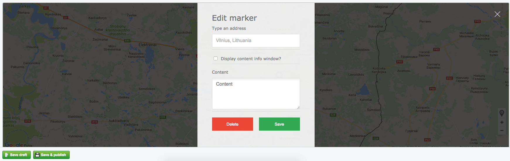

# SilverStripe Content Blocks

Accessories for [Blocks](https://github.com/sheadawson/silverstripe-blocks) module. This repository are always up-to-date with new features of blocks. 

## Blocks includes

* [Content Image](docs/CONTENT_IMAGE_BLOCK.md) - block can store multiple images with sortable feature, but it required to have [SortableUploadField](https://github.com/bummzack/sortablefile) dependency installed. Also have a nice feature like to choose the template for your layout (image below).

* [Google Maps](docs/GOOGLE_MAPS_BLOCK.md) - block with interactive google maps at the CMS. Can be set multiple markers, detecting zoom and position coordinates. Can be set global marker image or each marker individually.
 

## Global usage

