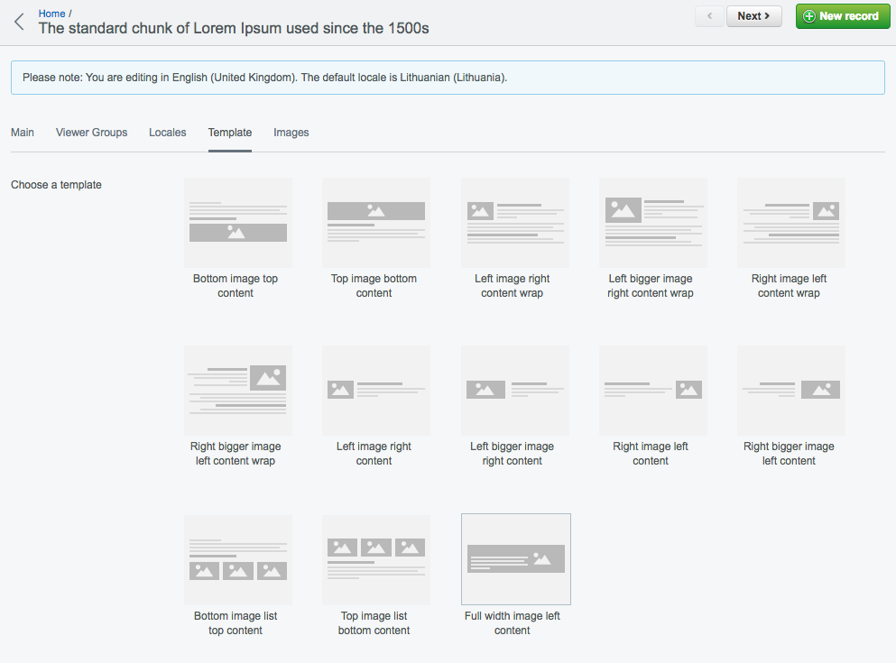
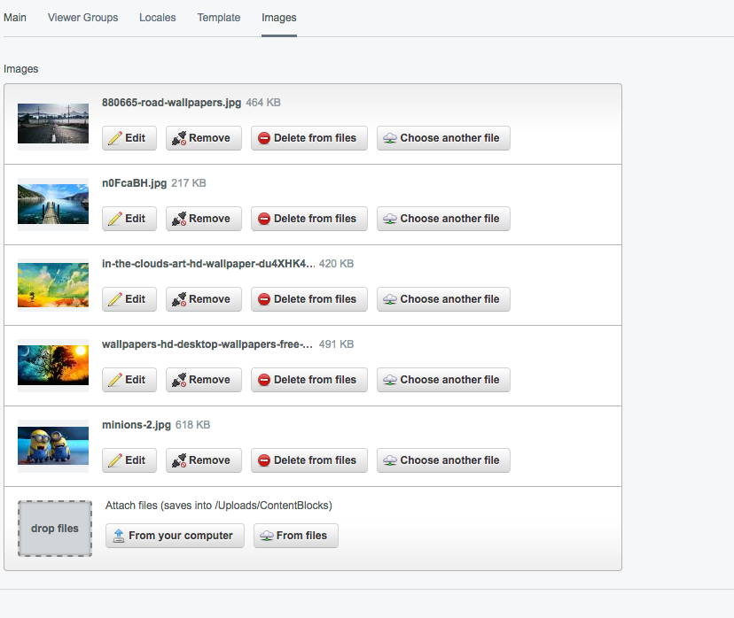
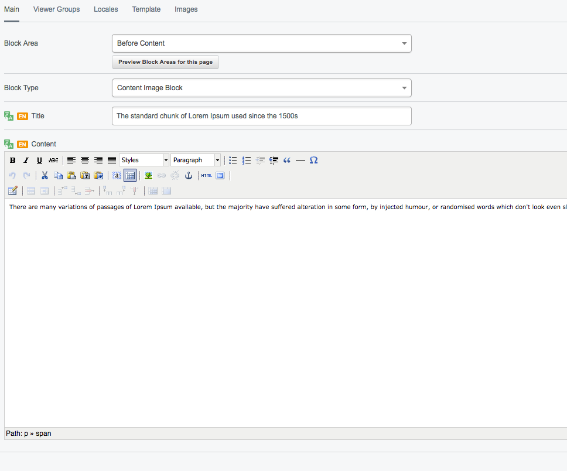

# Content Image Block



Content types are:
    
* BottomImageTopContent
* TopImageBottomContent
* LeftImageRightContentWrap
* LeftBiggerImageRightContentWrap
* RightImageLeftContentWrap
* RightBiggerImageLeftContentWrap
* LeftImageRightContent
* LeftBiggerImageRightContent
* RightImageLeftContent
* RightBiggerImageLeftContent
* BottomImageListTopContent
* TopImageListBottomContent
* FullWidthImageLeftContent"
    
Each content types can be styled and restructuring by defining your template at theme. Check [template](#template) section.

## Template

To override standard templates checkout `templates/ContentImageBlock.ss` and block types of `templates/ContentImageBlock_*.ss`.

example of `ContentImageBlock.ss`

```html
    <section id="content-block-{$ID}" data-cb="$BlockName" class="content-image-block">
        $Layout
    </section>
```

and `ContentImageBlock_BottomImageListTopContent.ss` example

```html
    <div class="content-image-block__bottom-image-list-top-content">
        <div class="content-image-block__bottom-image-list-top-content--content">
            <h2>$Title</h2>
    
            $Content
        </div>
    
        <div class="content-image-block__bottom-image-list-top-content--picture">
            <% loop $Images %>
                <div class="content-image-block__bottom-image-list-top-content--image">
                    $Fill(250, 250)
                </div>
            <% end_loop %>
        </div>
    </div>
```

## Screenshots



