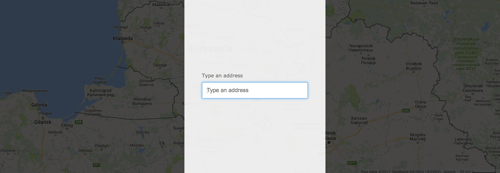
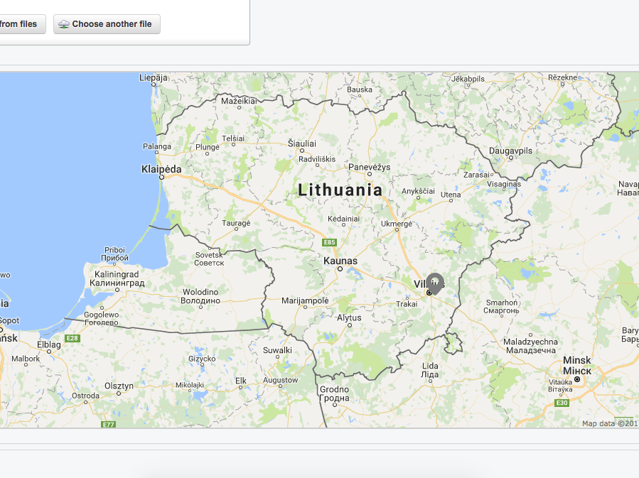
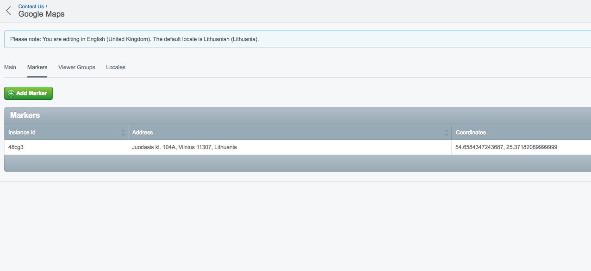
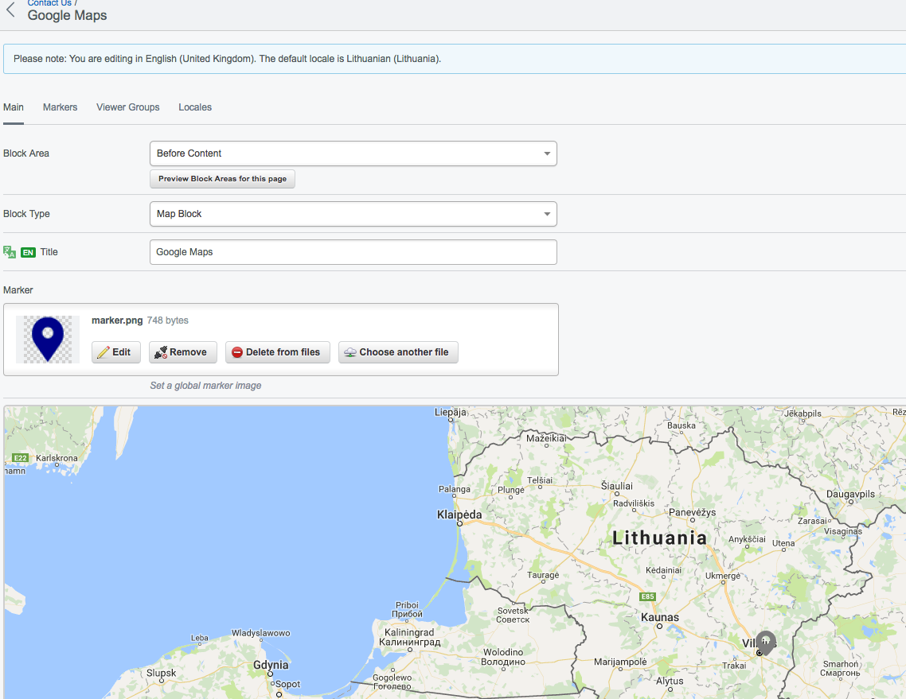

# Google Maps Block


## Set an API key

First of all go to the [Google Console](https://console.developers.google.com/) to create a new API key. Enable these two services:
 1. Google Maps JavaScript API (this is for handle it google map)
 2. Google Places API Web Service (this is for searching feature)

There are couple ways to set Google Maps API key to work with block, one of those - add this code fragment to your `config.yml`.

```yaml
    SiteConfig:
      extensions:
        # this will create GoogleMapsApiKey field, so
        # MapsSiteTree extension will handle this field
        - MapsSiteConfig
```

next way are set code fragment straight to the `GoogleMapField`

```yaml
    GoogleMapField:
      api: 'YourApiKeyFromGoogleConsole'
```

## Add styles to Google Map

One more good feature are to set your map styles (json) and handle it to the static property, here an example:

 1. Create a `styles.json` to `mysite/_config/`. (Styles can be get from [snazzymaps](https://snazzymaps.com/)).
 
```json
    [
        {
            "featureType": "all",
            "elementType": "labels.text.fill",
            "stylers": [
                // ...
            ]
        }
        // ...
    ]
```
 2. Add code fragment to your `_config.php` file

```php
    if (file_exists(($styles = sprintf("%s/%s/_config/styles.json", Director::baseFolder(), project())))) {
        $content = file_get_contents($styles);
        $content = preg_replace('/\s+/', '', $content);
    
        Config::inst()->update('MapBlock', 'map_styles', $content);
    }
```

## Screenshots





